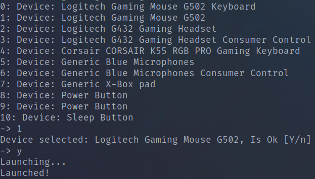

# Simple cli autoclicker for linux
[](https://crates.io/crates/theclicker)

Working on xorg and wayland.

Is using uinput and evdev!

## Running


## Install
```cargo install theclicker```

## Build

You need to have rust installed!

### On ArchLinux

```sudo pacman -S rustup```
```rustup toolchain install stable```

### On any unix os

```curl --proto '=https' --tlsv1.2 -sSf https://sh.rustup.rs | sh```
```rustup toolchain install stable```

```cargo build --release```

## To run ./theclicker

Select your mouse or keyboard.
Default binds are for mouse!
On mouse back or forword to activate left or right clicker!

You can use --find-keycodes to find what keycode you are pressing!
You can use --left-bind or --right-bind to set on what keycode the clicker will activate!

You can use --help to see more!

### If crash

Is posibile to not work on any distribution: ```sudo usermod -aG input $USER```

OR

```sudo ./theclicker```
